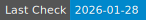

# AnalysisMEP R package

For users

## Installation
Some text for users

## Usage
Some text for users

For developers

## Before you start

### General

Anyone from the MEP group is welcome to contribute to the development of this R package.
The reason why we are limiting this to members of the group is that it is mainly used as
an internal package for research analyses. Please contact Florian / Fabian / Olga if you
want to improve this package.

### Branches

The repository has two protected branches 'main' and 'dev' where push is generally not allowed except 
for users with Admin rights (currently only Florian). This is not aimed at directly pushing any content
directly to those branches but there is no possibility to use a github-actions bot or semantic-release bot
to push commits automatically to those branches (as they are protected). Until an easy-to-implement feature
(not writing a fully functioning GitHub App...) exists, this branch rule will stay in place.

#### main

This is the release branch of the repository. As such, changes to the R package should have been 
tested and cleaned before deciding to publish a new release. Users will usually install the package directly
from the default branch (i.e. main) or they might opt to even specifically mention the version '@ X.Y.Z.'. In
our case, there should be no difference between the two.

#### dev

This the development branch where most of the work will actually happen. This is also a protected branch,
because at least 3+ people would like to include their work in this branch. Hence, pull requests and reviews
need to be conducted before merging. Due to different level of R package development skills, unit tests might
only get written after functions have been merged into it. However, unit tests need to exist before making 
releases. 

#### release

Depending on the availability of time etc., it might be decided to make a new release. In order to do this,
create a 'release' branch from the current state of the dev branch. Afterwards, no more new features get added
to that specific release and only (potential) bugs should be fixed amongst other chore/docs types of actions.
There should be no pull requests into the release from the dev branch. Once everything is ready, create a pull
request into the main branch to finalise the release process. All tests should be passed before accepting the
pull request! The release branch can be safely deleted after the PR has been merged into main.

#### feature / name (developer)

These branches are used by developers in order to add new or edit existing functionality. They should be in-sync
with the dev branch. While it would be good practise to already create or append unit tests before merging anything 
into the dev branch, this is optional right now. In case you are not providing unit tests, some small 
reproducible example would be helpful to write the tests afterwards. Upon opening a pull request, the
PULL_REQUEST_TEMPLATE.md will be automatically loaded (state of that file in the main branch!). Checks and
instructions for authors and reviewers are given there.

### Commit Messages

Commit messages should not be made in bulk but depending on the changes. It is better to commit more often
(without pushing the changes to the remote mirror). The commit messages should start with *one* of the following 
possibilities (I ranked them high to low). Here, we use the structure from the angular community 
(excluding 'build' and scopes). 'feat: ', 'fix: ' and 'perf: ' all relate to features (~ functions in our package). 
Currently, those commits are automatically filtered during the release process in order to create meaningful 
release notes.

- 'feat:' A new feature
- 'fix:' A bug fix to a feature
- 'perf:' A code change that improves performance of a feature

The commit message types below are important as well, however, they will not appear in the release notes.

- 'refactor:' A code change that neither fixes a bug nor adds a feature
- 'style:' Changes that do not affect the meaning of the code (white-space, formatting, missing semi-colons, etc)
- 'test:' Adding missing tests or correcting existing tests
- 'ci:' Changes to our CI configuration files and scripts 
- 'docs:' Documentation only changes

### GitHub-Actions

There are a few GitHub-Actions implemented in this repository to help with the process and identify
problems in an easier way. If you want to learn more about them, have a looking into the ./.github/workflow files.

#### R-CMD-Check

- When: once per week (scheduled) 
- When: on pull requests to main/dev branch 
- What: checks against ubuntu-latest / windows-latest for newest R and MEP-Server R version (4.3.0 currently)
- Why: can it be installed and passes the unit tests in the configs as is?

#### Code Coverage

- When: upon closing a pull request coming into the dev branch (except when it originates from 'main')
- What: calculates how many important codelines are covered by the unit tests currently, updates the number,
creates the batch, and re-writes the README.md file in case there were newly added/renamed functions
- Why: get an indication whether code has been tested or not and how well the tests cover the functions

#### Prepare Release

- When: upon closing a pull requests to main branch 
- What: initiates semantic-release workflow defined in the .releaserc.json file (analyses commits since last release,
identifies new package version depending on the changes, updates the package version in the DESCRIPTION file, prepares
release notes, creates a draft release)
- Why: structured way of increasing version releases from established communites
- Why: way too cumbersome to go through all the commits to see what has happened since last release
- Why: not automatically releasing in order to do some manual edits on release-notes
- Necessitates: using a consistent (currently: angular) commit message structure!!

## Test-Status of functions

Test-Coverage

The following percentages of code were covered during testing:

End of code coverage report.

